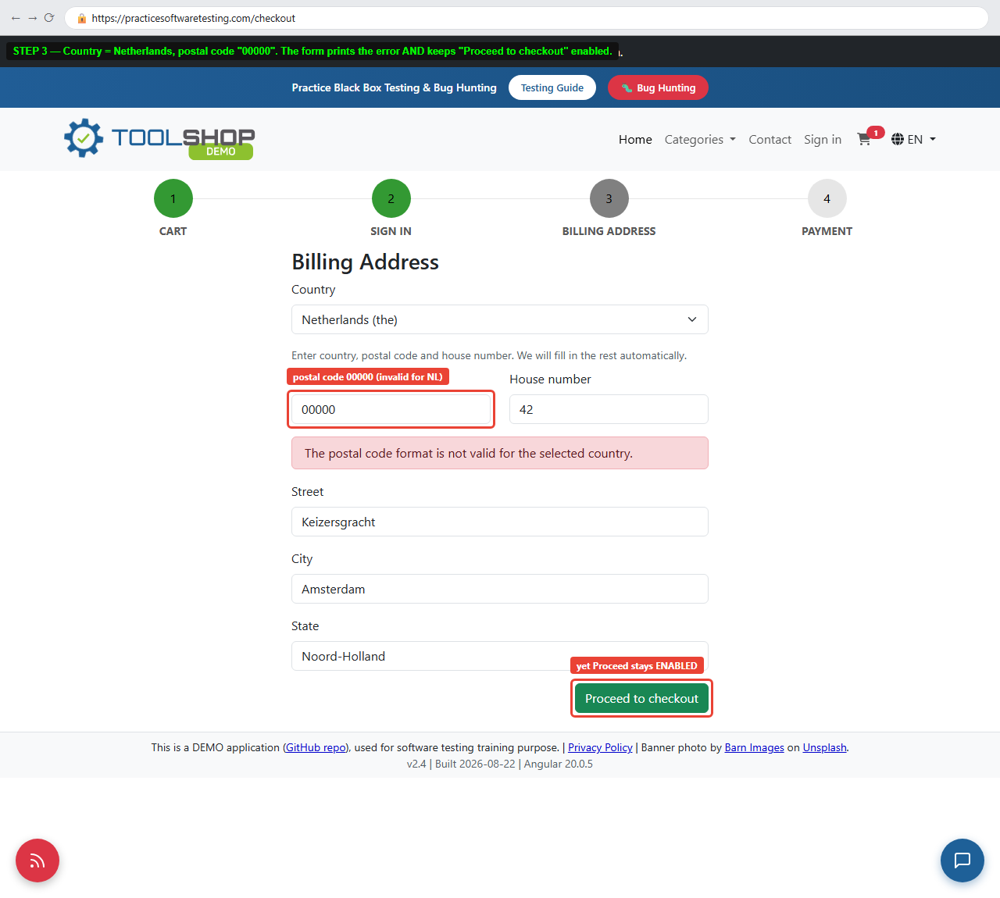

# Playwright E2E Showcase — UI, API and Visual Regression

[](https://github.com/Kubinis/playwright-e2e-showcase/actions/workflows/e2e.yml)
[](https://playwright.dev)
[](https://www.typescriptlang.org/)

An end-to-end suite against [practicesoftwaretesting.com](https://practicesoftwaretesting.com)
(Angular 20 storefront + Laravel REST API): **49 tests — 114 executions** across
Chromium, Firefox, WebKit, a phone viewport, the public REST API and five
component-level pixel baselines.

It is a work sample. The point is not that Playwright can click a button; it is
*which* checks are worth automating, and how a suite stays green for months
without anyone muting it.

---

## Why these tests

I spent eight years in manual QA before automating anything, and the suite reflects that:

| The test | The failure it is there to catch |
|---|---|
| Grid and detail page report the same price | The two views read different endpoints — a classic data-binding regression |
| Cart total equals unit price × quantity | Rounding bugs, which is where cart totals actually break |
| Cart survives a reload | Client state kept in memory instead of persisted |
| Search with no matches shows an empty grid | Stale results left on screen — the grid *looks* right |
| Sorting returns a monotone sequence | Sort applied to the page instead of the dataset |
| Pagination pages are disjoint (API) | Off-by-one in the offset, duplicating rows |
| Unknown product id returns 404, not empty 200 | The failure mode that lets a broken detail page ship |
| Wrong password and unknown email give the *same* error | Account enumeration |
| `/users/me` never returns a password field | Over-serialised user payload |
| A rejected account number explains why | A disabled Confirm button with no message reads as a broken page |
| Registration rejects a duplicate email (409) | Duplicate accounts on the same address |
| Conditional payment fields gate Confirm | Submitting a payment with no account details |

Coverage is deliberately shallow in places and deep where money moves: checkout gets
six tests, the language switcher gets none.

## A defect this suite found

While building it, one real bug turned up — the checkout accepts a postal code the
application itself reports as invalid, and confirms the order:

**[BUG-01 — Checkout accepts a postal code the app itself reports as invalid](docs/bug-reports/BUG-01-postal-code-not-enforced.md)**



It is encoded as a `test.fail()` case in `tests/ui/checkout.spec.ts`, so the suite
documents the expected behaviour today and turns green the day the bug is fixed.

A second suspected defect — "the bank account field rejects an IBAN with no message" —
did **not** survive verification: the message *"Account number must be numeric."* is
rendered, and my first probe had a faulty selector. It became a passing test instead of
a bug report. Filing that one would have cost a developer an afternoon.

## Layout

```
src/
  pages/          Page objects — one per screen, no assertions inside
  fixtures/       test.ts (typed fixtures) + data.ts (test data, no magic strings)
  api/            Typed REST client returning raw responses for status assertions
tests/
  ui/             catalog · product · cart · checkout · auth · contact
  api/            products · auth
  visual/         component-level pixel baselines
docs/bug-reports/ Bug report + annotated evidence
```

## Running it

```bash
npm ci
npx playwright install --with-deps
npm test                 # everything
npm run test:ui          # Chromium UI only
npm run test:api         # API only — 12 tests, ~3 s, no browser
npm run test:visual      # pixel baselines
npm run report           # open the HTML report
npx playwright test --grep @smoke     # smoke set
```

Point it at another environment without touching code:

```bash
UI_BASE_URL=https://staging.example.com API_BASE_URL=https://api.staging.example.com npm test
```

## Three ways this suite tried to break itself

Both were found by running it, not by reading about them — and both are the reason
the fixtures look the way they do.

**The demo database is rebuilt periodically and every record gets a new ULID.** The
first version pinned a product id; two hours later a third of the suite went red with
404s. Product *names* are stable, so a worker-scoped fixture resolves the id through
the search endpoint at run time. Any suite pointed at a seeded environment has this
problem — it just usually surfaces on a Monday morning instead of during development.

**Negative auth tests locked the shared demo account.** The app locks an account after
a few failed logins; running "wrong password" cases against the public demo login took
it down for every user of the site, this suite included. Now each worker registers its
own account through the API, and each negative test gets a separate disposable one, so
the lockout has nowhere to spread. On a client project this is the difference between a
CI run and a support ticket.

**The public demo answers CI with a Cloudflare challenge.** Every state-dependent
test went red on GitHub-hosted runners while passing locally. Measuring instead of
guessing found it in one request:

```
GET https://practicesoftwaretesting.com/  ->  HTTP/2 403
cf-mitigated: challenge
server: cloudflare
```

The API lives on a separate host without Cloudflare, which is why API tests stayed
green while the browser ones lost their cart and their session — pages rendered, but
the app's XHR calls died under the challenge. Working around someone else's WAF is not
an option I would ship, so CI now boots its own copy of the application
(`docker-compose.ci.yml`) from the project's published images and points the suite at
localhost. Local runs still default to the public instance.

A detail worth keeping: the upstream web image is published for arm64 only and dies
with `exec format error` on amd64 runners, so a stock `nginx:alpine` serves Laravel's
`public/` over php-fpm in its place.

## Design decisions worth stating

**`testIdAttribute: 'data-test'`.** The app tags every interactive element; the suite
addresses elements the way the developers intended, not by CSS class or visible text.
Playwright's default is `data-testid`, so this is set once in the config — the kind of
detail that otherwise produces a day of "the locator does not resolve".

**No `networkidle`.** The app holds a live-activity websocket open, so `networkidle`
never settles. Navigation waits for `domcontentloaded` and then for a page-specific
anchor element.

**Angular validates on blur.** Filling a field is not enough to update form validity —
the page object blurs before asserting on button state. Without it you get a false
"the Proceed button is broken".

**Wizard steps are hidden, not absent.** The 4-step checkout renders every step into the
DOM at once. Assertions use visibility (`toBeHidden`), never presence, otherwise every
"the user cannot skip a step" test passes for the wrong reason.

**`fullyParallel: true` against a shared instance.** Every test creates its own guest
email, so parallelism is what proves the tests are independent rather than a risk to
manage.

**Visual checks are component-level.** A full-page baseline breaks on any unrelated
content change and gets muted within a week. Header, product card, product detail,
contact form and cart table are stable surfaces where a diff usually means a real
regression. Animated and time-dependent elements are masked, not waited out.

**Baselines are per platform.** Both `-win32` (local) and `-linux` (CI) files live in
the repo; Playwright picks the right one automatically. A missing baseline is written and uploaded as an artifact, and the job fails on
purpose — a screenshot nobody looked at is not a baseline.

## CI

`.github/workflows/e2e.yml` — on push, PR, manual dispatch, and nightly at 06:00 UTC.

Every job first runs the `app-stack` composite action: it boots MariaDB, the Laravel
API, nginx and the Angular UI, seeds the database, and blocks until both the API and
the UI actually answer. Tests only start once the app is real — no fixed sleeps.

| Job | What it does |
|---|---|
| `api` | 12 API tests, no browser |
| `ui` | Matrix: chromium / firefox / webkit, `fail-fast: false` |
| `visual` | Compares committed baselines; a missing one is written, uploaded and the job fails so nobody merges an unreviewed image |

Every job uploads its HTML report; failures carry a trace (`npx playwright show-trace`),
screenshot and video. Baselines are per platform: the `-linux` files are what CI
compares against, the `-win32` ones come from local runs.

## Not in scope

Accessibility scans, performance budgets and load testing are deliberately absent —
they are separate deliverables with separate tooling, not something to bolt onto a
functional suite.

---

*The target is a public demo application maintained by the Practice Software Testing
project. No account of value, no personal data, and no destructive operations are
involved: every run creates a throwaway guest order.*
