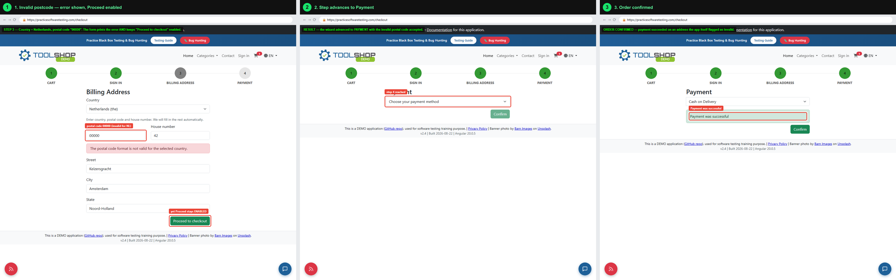

# BUG-01 — Checkout accepts a postal code the app itself reports as invalid

| | |
|---|---|
| **Severity** | Major |
| **Priority** | High |
| **Component** | Checkout → Billing Address (step 3) |
| **Environment** | practicesoftwaretesting.com v2.4, build 2026-08-22, Angular 20.0.5 |
| **Browsers** | Chromium 151, Firefox, WebKit — reproduced on all three |
| **Found** | 2026-09-03, while automating the guest checkout flow |
| **Automated by** | `tests/ui/checkout.spec.ts` → *Known defects* → "a postal code that does not match the country blocks the billing step" (`test.fail`) |

## Summary

The billing address form validates the postal code against the selected country and
displays *"The postal code format is not valid for the selected country."*, but the
field is still marked valid, **Proceed to checkout** stays enabled, and the order can
be placed and confirmed with the invalid address.

## Steps to reproduce

1. Open a product page and add the item to the cart.
2. Go to **Checkout** → **Proceed to checkout** → **Continue as Guest**, fill the guest details and continue.
3. On **Billing Address** select country **Netherlands (the)**.
4. Enter postal code `00000`, house number `42`, street `Keizersgracht`, city `Amsterdam`, state `Noord-Holland`.
5. Click outside the postal code field to blur it.
6. Click **Proceed to checkout**, choose **Cash on Delivery**, click **Confirm**.

## Expected

The postal code error blocks progress: **Proceed to checkout** is disabled (or the click
is rejected) until the postal code matches the selected country.

## Actual

The error message is displayed, yet the input carries Angular's `ng-valid` class, the
button remains enabled, step 4 is reached, and the payment is confirmed —
*"Payment was successful"* — against an address the application flagged as invalid.

## Evidence


Full flow, left to right — invalid input → payment step reached → order confirmed:



## Technical detail

At the moment the screenshot was taken the postal code input reads:

```
class="form-control ng-dirty ng-valid ng-touched"
```

`ng-valid` while the error text is rendered means the message comes from a source that
is not wired into the reactive form's validity state, so nothing disables the button.

## Impact

Orders are accepted with undeliverable addresses. The defect is invisible to the customer
(they see an error but the flow lets them continue), and it surfaces later as a failed
delivery and a support ticket.

## Notes

Checked against a rival explanation: a *correct* NL postal code (`1015 CS`) clears the
message, so the validator itself works — only its binding to form validity is missing.
